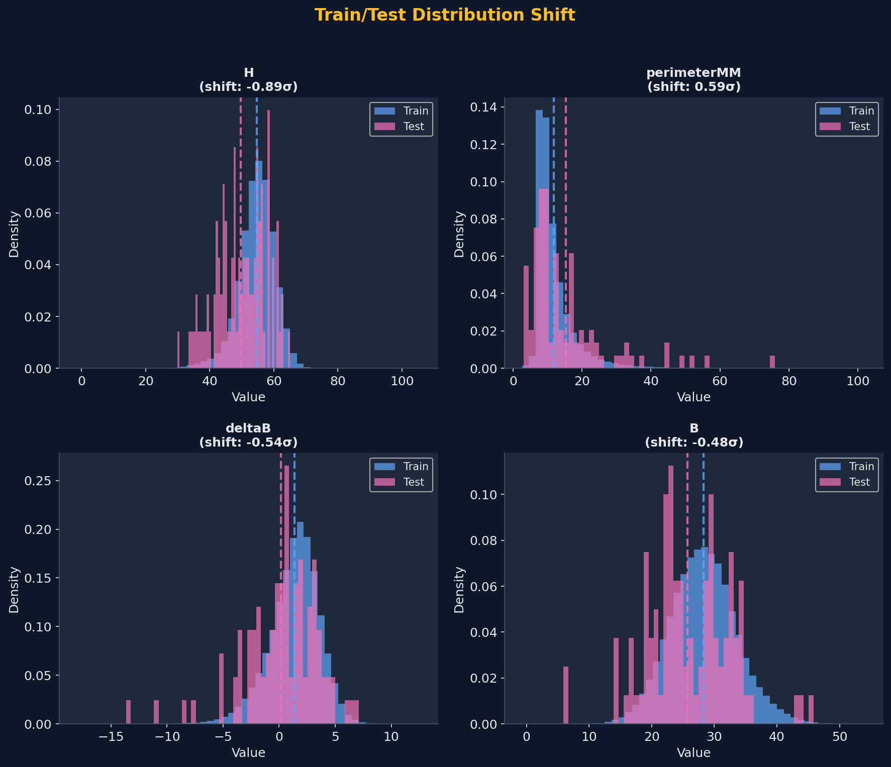

# Train→Test Distribution Shift Analysis

> Both vision backbones show severe prediction distribution shift between the training OOF
> predictions and the test-set predictions. This shift is the structural reason why
> rank normalization at inference is dangerous for this dataset.

---

## Vision Prediction Shift

Measured by comparing training out-of-fold (OOF) predictions against test-set predictions.
**Note: test set n=100** — K-S statistics are conservative given the small sample, but the effect size (2.3–2.5σ) is so large that significance is overwhelming regardless.

| Model | Train mean | Train std | Test mean | Shift (σ) | K-S p-value |
|---|---|---|---|---|---|
| EVA02 | 0.00531 | 0.04903 | 0.11845 | **+2.308σ** | 8.66e-64 |
| EdgeNeXt | 0.00815 | 0.06041 | 0.15854 | **+2.489σ** | 3.92e-26 |

T-test p-values: EVA02 3.86e-117, EdgeNeXt 4.23e-136 (both using training distribution as reference).

**After z-score standardization with training statistics**, the test values land at:
- EVA02: mean ≈ +2.31, std ≈ 4.64, range [−0.10, +19.76]
- EdgeNeXt: mean ≈ +2.49, std ≈ 4.20, range [−0.13, +15.80]

These are far outside the training feature range but represent the true signal: the test set genuinely contains higher-confidence predictions (likely because test images are better-cropped or the deployment distribution differs from training).

---

## Why Rank Normalization at Inference Is Dangerous

The shift is the mechanism. Walk through what happens:

1. Training OOF EVA02 predictions have mean 0.005, std 0.049 — nearly all values sit near zero.
2. Test EVA02 predictions have mean 0.118 — a 2.3σ upward shift. High-risk test lesions that genuinely score, say, 0.50 are in the upper tail of even the test distribution.
3. Rank normalization maps each test prediction to its **percentile within the test batch**. A test prediction of 0.50 — representing genuinely elevated malignancy probability — might rank at the 90th percentile of the test batch and get assigned ~0.90.
4. The model (XGBoost / MLP) was trained on z-scored features in the range [−3, +3] typical for standardized inputs. At inference it sees a feature value of 0.90 (rank percentile) instead of the z-scored equivalent of ~+10.1. These are incommensurable.
5. The double rank-normalization of the output (mismatch 3 in `train-inference-mismatch.md`) then further distorts the signal.

The net effect: predictions near the shifted test mean — which include true malignant cases — are mapped to extreme values, and the GBDT / MLP interprets them as out-of-distribution. Rank order of the final predictions becomes uncorrelated with true malignancy probability.

---

## Raw Metadata Feature Shift: Lower Concern

For comparison, raw clinical metadata features shift much less:

| Feature | Train→Test shift |
|---|---|
| `tbp_lv_H` (hue) | ~0.89σ |
| `perimeterMM` | ~0.59σ |
| `deltaB` (color delta B) | ~0.54σ |
| `B` (color B channel) | ~0.48σ |

All below 1σ. Z-score standardization with training statistics handles these shifts adequately — the model sees slightly out-of-center inputs but not catastrophically so. Monitor these features on future data but treat them as low priority compared to the vision prediction shift.

*Per-feature train→test mean shift for raw clinical metadata (signed σ; negative = test mean below
train mean). Magnitudes match the table above; all remain under 1σ, in contrast to the +2.3–2.5σ
vision-prediction shift.*

---

## Implication for Future Work

- **Never rank-normalize vision predictions at inference.** Use z-score with training statistics.
- The shift itself is not necessarily harmful — it may reflect genuine test-set signal. The harm comes entirely from preprocessing that treats the test distribution as if it matches training.
- If the shift source is ever diagnosed (domain mismatch, image preprocessing differences, model calibration), test-time z-score normalization using training OOF statistics will still be the correct default.
