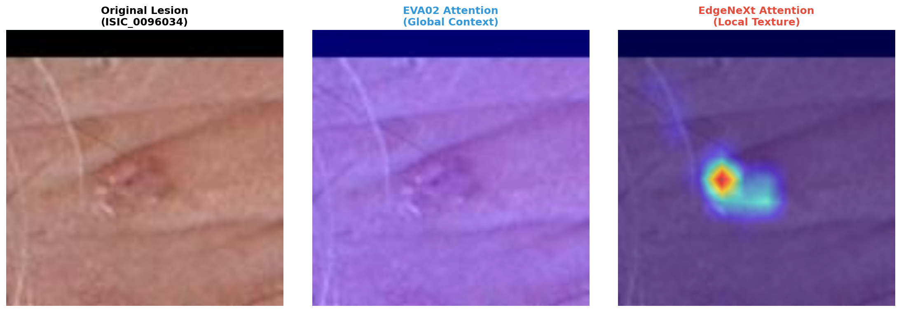
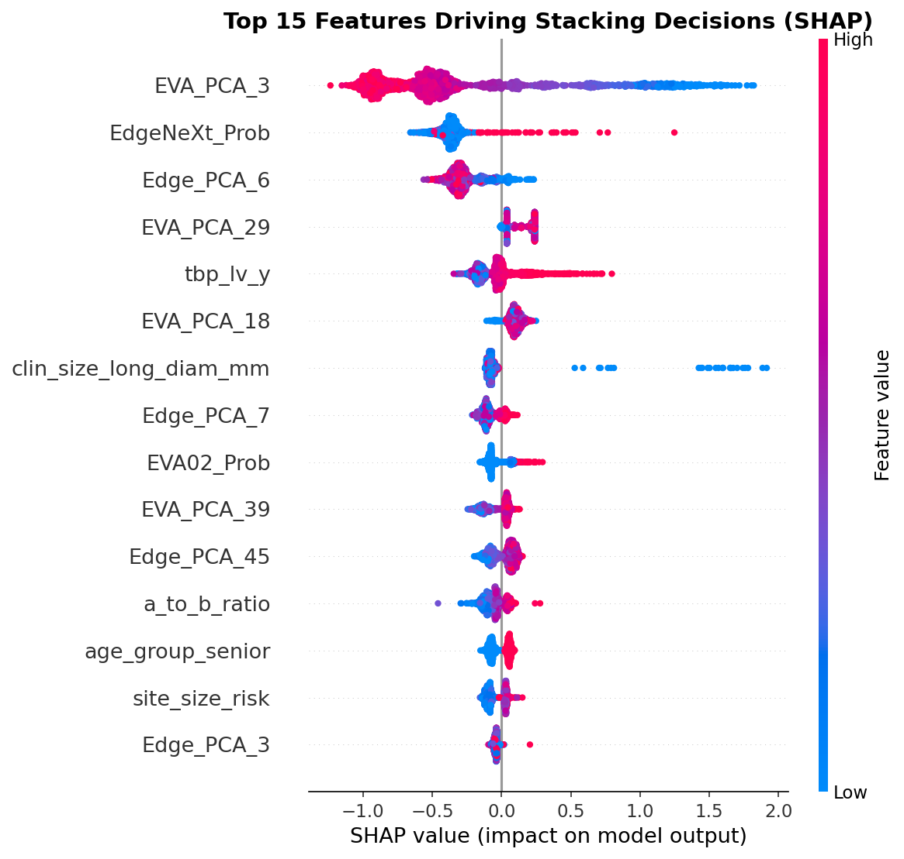

# Explainability

A malignancy classifier is only trustworthy if it attends to the lesion rather than to an artifact —
a ruler mark, a hair, a patch of healthy skin. Two complementary views are used here: **Grad-CAM** on
the vision backbones (what region drives the image score) and **SHAP** on the stacking model (which
features drive the final decision). Both are qualitative sanity checks, not a quantitative
interpretability benchmark — read them as evidence the model is looking in the right place, not as a
guarantee.

## Vision: where the backbones look (Grad-CAM)

*Grad-CAM on a malignant sample (`ISIC_0096034`). Left: the original lesion. Middle: EVA02 attention —
diffuse, spread across the field (global context). Right: EdgeNeXt attention — a sharp hotspot
localized on the lesion body (local texture).*

The two backbones attend differently on purpose. EVA02 (a ViT) integrates **global context**;
EdgeNeXt (a ConvNeXt-family model) concentrates on **local texture** at the lesion. This is the
visual counterpart of the quantitative diversity that makes them worth ensembling — their OOF
predictions correlate only ≈0.25 (see [`train-inference-mismatch.md`](train-inference-mismatch.md) §
vision diversity). Crucially, EdgeNeXt's hotspot sits on the lesion, not on the surrounding skin or an
acquisition artifact — the model is keying on the right structure.

Generated by `reports/presentation/scripts/generate_vision_explainability.py` (PyTorch + `pytorch-grad-cam`;
GPU; loads a trained backbone checkpoint).

## Tabular: what drives the stacker (SHAP)

*SHAP values for the top-15 features of the XGBoost stacker (fold-0 validation set). Each dot is a
sample; horizontal position is the feature's push on the prediction; color is the feature value
(red = high, blue = low).*

Three things this confirms:

1. **Vision signal carries the stacker.** The highest-impact features are vision embeddings
   (`EVA_PCA_3`, `Edge_PCA_6`, `EVA_PCA_29`, …) and the raw vision probabilities (`EdgeNeXt_Prob`,
   `EVA02_Prob`). The image models do the heavy lifting; the metadata refines.
2. **The metadata that matters is clinically sensible.** `clin_size_long_diam_mm` (lesion diameter)
   shows a clean monotone effect — large lesions (red) push strongly toward malignant. `age_group_senior`
   and `site_size_risk` contribute in the expected direction.
3. **`tbp_lv_y` ranks high — and we know why.** The metadata audit established that `tbp_lv_y` is a
   **body-location proxy**, not an independent biological signal (ANOVA F ≈ 341,202). Its SHAP
   prominence is consistent with that interpretation and is a reason not to over-read it — see
   [`metadata-audit.md`](metadata-audit.md) and [`domain-rules.md`](domain-rules.md).

Generated by `reports/presentation/scripts/generate_tabular_shap.py` (`shap` TreeExplainer over the
trained XGBoost stacker). Note: it imports `feature_engineering` from `stacking/src/` in this layout —
adjust the path if you re-run it.

## Scope & limitations

- The Grad-CAM panel is a **single illustrative sample**; the SHAP panel is the **fold-0 validation
  set**. Neither is a population-level interpretability study.
- Grad-CAM shows *where* attention falls, not *why* a feature is causal.
- A natural next step is a quantitative attribution check (e.g. deletion/insertion curves for
  Grad-CAM, or SHAP-interaction analysis on the metadata) — see
  [`../README.md`](../README.md) § Open questions.
