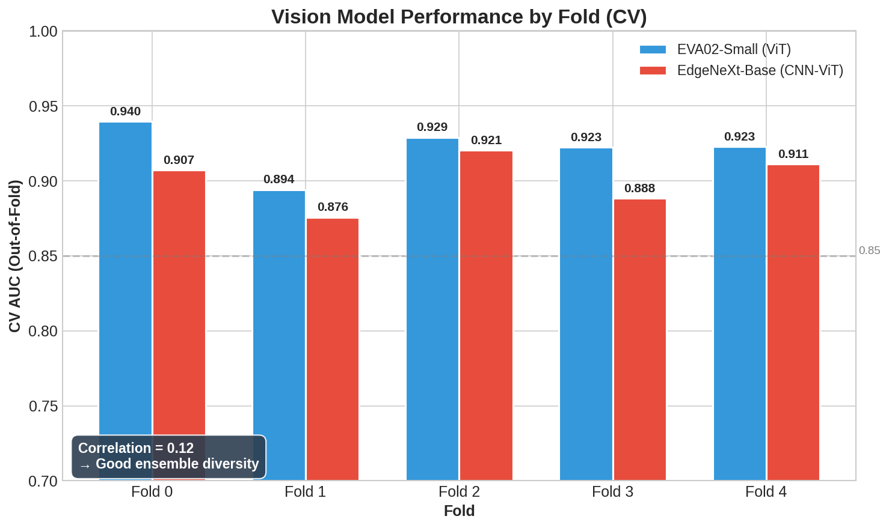

# Model Evolution — ISIC 2024

All numbers below are **self-reported** (local val AUC or public-LB pAUC where noted). They are
development proxies. Local AUC is **not** the competition metric; the leaderboard reports
**pAUC above 80% TPR** (typically ~0.16–0.18 for competitive submissions). See
[domain-rules.md](domain-rules.md) for why conflating them is dangerous.

---

## Stage-by-stage narrative

| Era | Scripts | What changed | What was learned | Best result (self-reported) |
|---|---|---|---|---|
| **1 — Baseline** | `1–2` | Scratch `SimpleCNN` trained directly on HDF5 images; no metadata | Images alone carry almost no signal under 1:1168 imbalance; the model collapses to near-random | ~0.51 AUC |
| **2 — Metadata fusion** | `3` | First image+metadata hybrid: custom CNN trunk + metadata MLP branch + Focal Loss (α=0.25, γ=2.0) | **Metadata is the single biggest single jump in the entire project** (+0.43 AUC). Focal Loss alone could not compensate for missing metadata | ~0.936 AUC |
| **3 — Transfer learning** | `4–5` | Pre-trained **EfficientNetV2-S** hybrid (~0.951) vs ResNet34 hybrid (~0.938); IMAGENET weights fine-tuned | V2-S backbone clearly better; ResNet34 added architectural diversity but lower ceiling | ~0.951 AUC (V2-S) |
| **4 — Ensembles + K-Fold** | `6–9` | Weighted model averaging; TTA; **5-fold StratifiedGroupKFold**; EfficientNetV2-M variant | CV discipline (patient-aware splits) is non-negotiable; ensembling diverse folds gives free variance reduction | CV ~0.947 ± 0.003 |
| **5 — Feature engineering** | `10–11` | Engineered metadata: age buckets, ABCDE composites (size/color/shape); added ConvNeXt, ViT backbones; EMA/SWA | Feature engineering helped the noisy folds but gave marginal overall gains; more features is not always better | CV ~0.9468 ± 0.0117 |
| **6 — GBDT stacking v1** | `12, 14–17` | OOF vision predictions → second-level XGBoost/CatBoost; introduced EVA02-Small + EdgeNeXt-Base backbones (stage 14) | GBDT on tabular+vision outperforms pure neural. EVA02+EdgeNeXt combination set the backbone standard for all later work. **Broken `16_5`** (rank-norm mismatch) produced 0.48 pAUC — later diagnosed and fixed | LB pAUC ~0.93 (vision only) |
| **7 — Retrospective** | `13` | Analysis-only notebook scanning all prior runs; decided to pivot backbones | Negative results are results; the pivot to EVA02+EdgeNeXt was data-driven | (analysis only) |
| **8 — Two-stage stacking** | `16–17`, `last_run/` | EVA02-S + EdgeNeXt-Base vision ensemble → logits + top-50 PCA embeddings → XGBoost + MLP (DAE latents) | PCA embeddings beat logits alone; DAE latents help MLP but not trees; **"Golden Split"** (train folds 0-3, exclude fold 4) is the SOTA configuration; CatBoost dragged down ensembles | Public LB: 0.98997 (single fold) / 0.98245 (5-fold ensemble) — see caveat below |
| **9 — Dual-backbone end-to-end** | `18_*` | Single model: EVA02 (@336) + EdgeNeXt (@384) + metadata encoder → fusion MLP; EMA; AMP; 1:1 balanced sampling; patient-relative "Ugly Duckling" features + LOF | LOF nudged pAUC 0.18149→0.18185; 1:1 balanced sampling beats Focal Loss alone; end-to-end training simplifies the submission pipeline | **0.9503 ± 0.0092 AUC** (regular weights, recomputed — see note below) |

---

## The two endgames

Both endgames use the same EVA02-Small + EdgeNeXt-Base backbone pair.

**A) Dual-backbone end-to-end** (`18_*`, artifacts in `results/dual_hybrid_v2/`): one model, one
training loop, simpler submission. 5-fold CV AUC = **0.9503 ± 0.0092** (regular weights),
**0.9484 ± 0.0128** (EMA weights). Submit the EMA ensemble.

**B) Two-stage stacking** (`last_run/`): vision stage outputs logits + PCA(50) embeddings → GBDT
stage (XGBoost + MLP, averaged). Public-LB scores 0.98997 / 0.98245 are **self-reported and
metric-scale-ambiguous** — the project's true competition pAUC@80%TPR figures are ~0.16–0.18, so
these numbers almost certainly reflect a different AUC scale and should not be compared directly to
the competition leaderboard without caveat.

*Per-fold out-of-fold CV AUC for the vision backbones feeding the stacking stage. Fold-to-fold
spread (~0.88–0.94) illustrates why single-fold numbers are unreliable and why the "Golden Split"
(fold 4 excluded) was investigated — see [`domain-rules.md`](domain-rules.md).*

---

## Reproducibility note — the 0.9612 correction

The CLAUDE.md workspace file (and early documentation) cited a dual-backbone CV AUC of
**0.9612 ± 0.0038**. During portfolio cleanup, the five OOF files in
`results/dual_hybrid_v2/oof_fold{1..5}.csv` were recomputed from scratch. The correct figure is
**0.9503 ± 0.0092** (regular) / **0.9484 ± 0.0128** (EMA).

**What is established:** only the OOF-based recomputation is verified. Recomputing AUC from the full,
imbalanced held-out folds (`results/dual_hybrid_v2/oof_fold{1..5}.csv`) gives 0.9503 ± 0.0092 — the
only statistically valid estimate of generalization here.

**A plausible (but unconfirmed) cause:** the 0.9612 figure was likely recorded at training time from
an in-loop metric using a different evaluation protocol — for instance, computed on the 1:1 balanced
batches rather than the true ~0.085%-prevalence fold, which would inflate apparent AUC. This is a
hypothesis consistent with the gap, **not** a confirmed root cause; the discrepancy was not traced
beyond establishing the correct OOF number.

**Lesson:** always persist raw OOF predictions and recompute metrics from them, never trust a number
copied from a training log.
