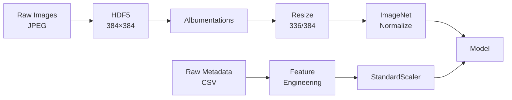
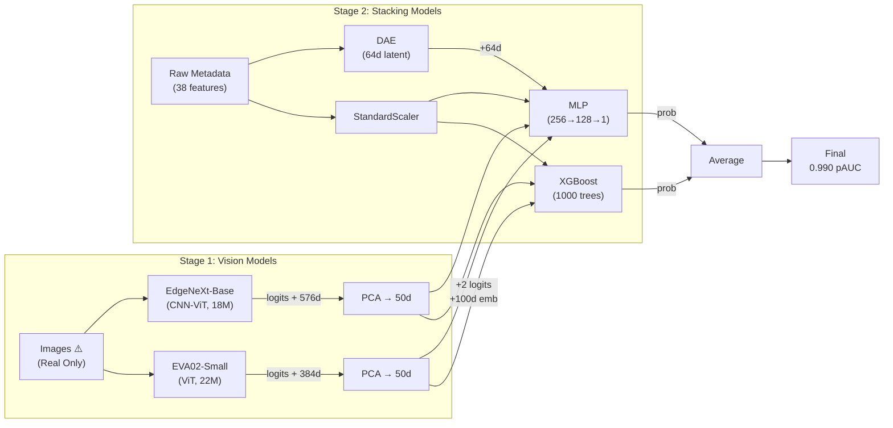

<div style="font-size: 3.5rem; font-weight: 700; margin-bottom: 1rem;">Stacked Melanoma Detection</div>

<div style="font-size: 1.25rem; opacity: 0.7; margin-bottom: 3rem;">Fusing Vision Models with Clinical Metadata</div>

<div>
  <span style="font-weight: 500;">Los Backpropagators</span><br/>
  <span style="opacity: 0.6; font-size: 0.875rem;">María Muñoz Pérez · Isabel Carballo Rueda · MohammadErfan Jabbari</span>
</div>

<div class="abs-br m-6 text-sm opacity-50">
  Deep Learning · UC3M · Winter 2025
</div>

---

# Problem Overview

<div style="font-size: 1.4rem; margin: 2rem 0 3rem 0; padding: 1.5rem; background: rgba(59, 130, 246, 0.1); border-radius: 8px; border-left: 4px solid #3b82f6;">
  <strong>Goal:</strong> Classify skin lesions as malignant or benign using dermoscopic images and clinical metadata.
</div>

### This Presentation

1. **Data Challenges** — Dataset Analysis, Class Imbalance Handling

2. **Feature Engineering** — Data Preprocessing, Data Augmentation, Feature Engineering

3. **Model Architecture & Results** — Two-stage vision-tabular stacking, Model Selection, Model Evaluation

4. **Explainability** — Vision Model Analysis, Stacking Analysis, Architecture Analysis

---
layout: section
---

# Data Imbalance Handling

---

# The Problem: Extreme Imbalance

<div class="grid grid-cols-2 gap-4">
<div>

### Class Distribution

| Class | Count | Percentage |
|-------|-------|------------|
| Benign | 400,616 | 99.915% |
| Malignant | 343 | **0.085%** |

**Ratio: 1:1168**

</div>
<div>

### Consequence

Without intervention, the model learns:
- Predict **all negative** → 99.9% accuracy
- But **AUC ≈ 0.50** (random)

Our baseline CNN achieved exactly this.

</div>
</div>

---

# Our Solution: Weighted Sampling

**WeightedRandomSampler** — samples inversely proportional to class frequency:

```python
weight_for_0 = 1.0 / neg_count  # ≈ 2.5e-6
weight_for_1 = 1.0 / pos_count  # ≈ 0.003
samples_weight = train_df['target'].map({0: weight_for_0, 1: weight_for_1})
sampler = WeightedRandomSampler(samples_weight, len(samples_weight))
```

<div class="mt-6">

### Effect
- Each epoch: positives sampled ~1168× more often
- Model sees balanced class distribution during training
- Simple, no loss function modification needed

</div>

<div class="text-sm opacity-70 mt-6">
1st place insight: <em>"Balanced sampling works better than Focal Loss alone"</em>
</div>

---

# Alternative: Focal Loss

Down-weights easy negatives, focuses on hard examples:

$$\mathcal{L}_{\text{focal}} = -\alpha (1-p_t)^\gamma \log(p_t)$$

```python
class FocalLoss(nn.Module):
    def forward(self, inputs, targets):
        bce_loss = F.binary_cross_entropy_with_logits(inputs, targets, reduction='none')
        p_t = torch.exp(-bce_loss)
        focal_loss = self.alpha * (1 - p_t) ** self.gamma * bce_loss
        return focal_loss.mean()
```

<div class="mt-4 p-3 bg-amber-900/30 rounded">

**Note**: We experimented with Focal Loss in earlier iterations, but the final submission uses simple `BCEWithLogitsLoss` + weighted sampling.

</div>

<!-- ---

# Summary: Imbalance Handling

| Technique | Status | Rationale |
|-----------|--------|-----------|
| **WeightedRandomSampler** | ✅ Used | Oversamples minority, simple |
| **BCEWithLogitsLoss** | ✅ Used | Standard loss, sampling handles balance |
| Focal Loss | Explored | Tested in experiments, not in final |
| SMOTE | ❌ Not used | Complex, mixed results in literature |

<div class="mt-6 p-4 bg-blue-900/30 rounded">

**Key insight**: Sampling-based solutions worked better than loss modifications for this extreme imbalance (1:1168).

</div> -->

---

<h1 class="text-2xl font-bold mb-1">Addressing Data Imbalance</h1>
<div class="text-base opacity-80 mb-4">Synthetic Generation with Stable Diffusion</div>

<div class="grid grid-cols-2 gap-4 text-sm">
<div class="flex flex-col justify-center gap-2">

<h3 class="font-bold text-base text-secondary-400">The Challenge</h3>
<div class="leading-tight">Positive cases (Malignant) are extremely rare (<1% of data). Standard oversampling leads to overfitting on duplicates.</div>

<h3 class="font-bold text-base text-secondary-400">Generative Solution</h3>
<div class="leading-tight">We fine-tuned <strong>Stable Diffusion 1.5</strong> on the malignant subset to generate localized, high-fidelity synthetic lesions.</div>

<h3 class="font-bold text-base text-secondary-400">Methodology</h3>
<ol class="list-decimal pl-4 space-y-1 leading-tight">
<li class="pl-1"><strong>Fine-Tuning</strong>: Learned lesion textures/borders (128x128).</li>
<li class="pl-1"><strong>Generation</strong>: Created 10,000 candidate samples.</li>
<li class="pl-1"><strong>Filtration</strong>: Used a "Hybrid Model" to keep only high-confidence samples (Top 6k).</li>
</ol>

</div>
<div class="flex items-center justify-center">
  
</div>
</div>

<!--
PRESENTER NOTES:

1. DATA IMBALANCE:
   - Medical data is naturally imbalanced.
   - Simply repeating the few malignant images causes the model to memorize them.

2. STABLE DIFFUSION PIPELINE:
   - We used Generative AI (SD 1.5) to "imagine" new malignant cases.
   - These aren't just copies; they are new, diverse examples that follow the visual patterns of melanoma.

3. QUALITY CONTROL (Filtering):
   - We just usede the best complete classfeir model that we had at the moment to fitler the images.
   - Not all generated images are perfect.
   - We used our best classifier to "grade" them.
   - If the classifier said "This looks malignant" (High Confidence), we kept it.
   - This ensures we don't train on noise.
-->

---
layout: section
---

# Preprocessing & Data Augmentation

---

# Data Pipeline Overview



<div class="mt-4 text-sm">

- **Image preprocessing**:
  - Original images have variable sizes (67–139px) → upsampled to 384×384
  - Upsampling required: vision models (EVA02, EdgeNeXt) expect fixed input sizes
  - Resampling method: **LANCZOS** (preserves edge sharpness vs bilinear)
- **Storage**: HDF5 with LZF compression for fast random I/O
- **Final resize**: 336×336 (EVA02) or 384×384 (EdgeNeXt) at training time
- **Normalization**: ImageNet mean/std

</div>

<!--
PRESENTER NOTES:
- Original ISIC images are small thumbnails (67-139 px), not full resolution dermoscopy
- We upscale to 384 first (preprocessing), then resize to model-specific size during training
- LANCZOS (sinc-based) is better than BILINEAR for upscaling medical images
- HDF5 provides ~10x faster loading than individual JPEG files
- LZF compression: ~40% size reduction with fast decompression
-->

---

# Image Augmentation

<div class="grid grid-cols-2 gap-4">
<div>

**Transforms Applied** (Albumentations):

```python
A.Compose([
    A.Transpose(p=0.5),
    A.VerticalFlip(p=0.5),
    A.HorizontalFlip(p=0.5),
    A.RandomRotate90(p=0.5),
    A.ColorJitter(
        brightness=0.2, contrast=0.2,
        saturation=0.2, hue=0.1, p=0.7),
    A.OneOf([
        MotionBlur, MedianBlur,
        GaussianBlur, GaussNoise
    ], p=0.7),
])
```

</div>
<div>

**Rationale**:
- Skin lesions have no canonical orientation → flip/rotate
- Lighting varies across scanners → color jitter
- Camera quality varies → blur/noise

**Design choices**:
- **Aggressive**: 70% of samples get color/blur transforms
- **Test-time**: No augmentation (only resize + normalize)
- **Excluded**: RandomCrop, Cutout (risk losing small lesions)

</div>
</div>

<!--
PRESENTER NOTES:

1. AGGRESSIVE AUGMENTATION (p=0.7):
   - Most samples get color jitter AND blur/noise applied
   - This is intentional: with only 343 malignant samples, aggressive augmentation prevents overfitting
   - Combined with balanced sampling, this creates diverse training signal

2. TEST-TIME BEHAVIOR:
   - Validation and test use ONLY: Resize → Normalize
   - No TTA (Test-Time Augmentation) applied in our submission
   - This keeps inference simple and deterministic

3. WHAT WE DIDN'T USE:
   - RandomCrop: Lesions can be small (67-139px original), cropping might remove diagnostic features
   - Cutout/RandomErasing: Same issue — might mask the lesion itself
   - MixUp/CutMix: Tried in experiments but didn't help with extreme imbalance
   - Heavy geometric distortion (affine shear): Risk distorting clinical features

4. INSPIRATION:
   - This augmentation pipeline is similar to what 1st place used
   - Key insight: for medical imaging, preserve diagnostic features while adding realistic variations
-->

---

# Augmentation Examples


<div class="text-sm text-center opacity-70 mt-2">
Same malignant lesion with different augmentation transforms applied
</div>

<!--
PRESENTER NOTES:

1. THIS IS A MALIGNANT SAMPLE:
   - Randomly selected from the 343 confirmed malignant cases
   - Shows realistic features: irregular border, color variation

2. TRANSFORM PROBABILITIES:
   - Flip/Rotate: p=0.5 (50% chance each)
   - ColorJitter: p=0.7 (70% chance)
   - Blur/Noise: p=0.7 (70% chance)
   - These stack: many training samples get multiple transforms

3. SUBTLE EFFECTS:
   - Blur effects are subtle but matter for robustness
   - Gaussian Noise simulates camera sensor noise
   - Motion Blur simulates slight camera shake

4. WHAT'S NOT SHOWN:
   - Multiple transforms can be applied simultaneously
   - Each epoch sees different random combinations
-->

---

# Metadata Analysis: Top Correlations

<div class="grid grid-cols-5 gap-4">
<div class="col-span-3">


</div>
<div class="col-span-2 text-sm">

**Key findings** (raw metadata, not engineered):

- **Size features dominate** — area, perimeter correlate positively with malignancy (ABCDE "D")
- **DNN confidence is strongest** — lower confidence = more suspicious
- **All correlations weak** ($|r| < 0.05$) — no single feature is predictive

→ Justifies need for feature engineering

</div>
</div>

<!--
PRESENTER NOTES:

0. ABCDE RULE (CLINICAL MELANOMA SCREENING):
   - A = Asymmetry: One half doesn't match the other
   - B = Border: Irregular, ragged, or blurred edges
   - C = Color: Uneven color distribution (brown, black, tan, red, white, blue)
   - D = Diameter: Larger than 6mm (pencil eraser size)
   - E = Evolution: Changes in size, shape, or color over time
   - Used by dermatologists as quick screening heuristic
   - Our feature engineering encodes each criterion computationally

1. THESE ARE RAW METADATA FEATURES:
   - All from original ISIC TBP (Total Body Photography) system
   - NOT our engineered features — those come next slide
   - This analysis motivated what features we engineered

2. TOP POSITIVE CORRELATIONS (malignancy indicators):
   - tbp_lv_areaMM2 (r=0.041): Larger lesions more likely malignant
   - tbp_lv_perimeterMM, minorAxisMM: Size metrics cluster together
   - Clinical alignment with ABCDE "D" for Diameter

3. DNN CONFIDENCE EXPLAINED:
   - tbp_lv_dnn_lesion_confidence (r=-0.048): STRONGEST correlation
   - Pre-computed by TBP imaging system
   - High confidence = clearly a recognizable lesion (usually benign-looking)
   - Low confidence = ambiguous/unusual appearance → correlates with malignancy
   - Counterintuitive: system is LESS confident about malignant lesions

4. ALL CORRELATIONS ARE WEAK (|r| < 0.05):
   - No single feature strongly predicts malignancy
   - Justifies need for complex models and feature engineering
   - Simple linear models would fail here
-->

---

# Feature Engineering: ABCDE Rule

<div class="grid grid-cols-2 gap-6">
<div>


</div>
<div class="text-sm">

| Letter | Criterion | Our Feature |
|--------|-----------|-------------|
| **A** | Asymmetry | `asymmetry_score` (color + shape) |
| **B** | Border | `shape_regularity`, `compactness` |
| **C** | Color | `color_variance`, `darkness_score` |
| **D** | Diameter | `large_lesion` (>6mm flag) |
| **E** | Evolution | `age_risk`, `age_size_risk` |

**28 total engineered features**

</div>
</div>

<!--
PRESENTER NOTES:

1. ABCDE RULE OVERVIEW:
   - Clinical standard used by dermatologists for melanoma screening
   - We encode EACH criterion as computable numerical features
   - This grounds our feature engineering in medical domain knowledge

2. A = ASYMMETRY:
   - asymmetry_score: Combines color norm + radial color std + shape irregularity
   - Formula: (tbp_lv_norm_color + tbp_lv_radial_color_std_max + 1/shape_regularity) / 3
   - Higher score = more asymmetric = more suspicious

3. B = BORDER IRREGULARITY:
   - shape_regularity = area / perimeter² (circle has maximum, irregular borders have lower)
   - compactness = 4πA/P² (isoperimetric quotient, 1 = perfect circle)
   - eccentricity = minorAxis / √area (oval vs round)
   - log_perimeter, log_area, area_to_perimeter ratio

4. C = COLOR VARIATION:
   - color_variance = √(ΔB² + radial_std² + color_std²) — Euclidean norm of color deviations
   - color_contrast = ΔB × radial_color_std_max
   - color_uniformity = 1 / (norm_color + ε)
   - darkness_score = B / (H + ε) — blue/hue ratio
   - h_to_b_ratio, a_to_b_ratio — LAB color space ratios

5. D = DIAMETER > 6mm:
   - large_lesion = binary flag (1 if size_mm > 6, else 0)
   - Clinical threshold: 6mm = pencil eraser size
   - Also: lesion_size_mm, size_category, size_squared, log_size

6. E = EVOLUTION (using age as proxy):
   - Evolution is hard to compute from a single image
   - We use age as proxy: older patients have higher melanoma risk
   - age_risk = binary (1 if age > 50)
   - age_squared = non-linear effect
   - INTERACTION FEATURES:
     - age_size_risk = age × lesion_size
     - age_color_risk = age × color_variance
     - age_site_risk = age × anatomical site risk score

7. ANATOMICAL FEATURES:
   - high_risk_site = binary flag for torso, head/neck, upper extremity
   - site_risk_score = ordinal (head/neck=4, torso=3, extremity=2, palms/soles=1)
   - site_size_risk = site score × lesion size

8. TOTAL: 28 engineered features added on top of ~45 raw metadata columns
-->

---

# Feature Engineering: Patient-Relative Features

### "Ugly Duckling" Principle

Malignant lesions often look **different** from a patient's other lesions. We capture this with:

- **Patient Z-Score**: $z = \frac{x - \mu_{\text{patient}}}{\sigma_{\text{patient}}}$ — measures deviation from patient's average
- **Local Outlier Factor (LOF)**: Anomaly detection that scores how unusual a lesion is relative to the patient's other moles

### Key Formulas

- **Shape Regularity**: $\frac{A}{P^2}$ — circle has maximum value, irregular borders score lower
- **Color Variance**: $\sqrt{\Delta B^2 + \sigma_r^2 + \sigma_c^2}$ — magnitude of color deviation

<div class="mt-4 p-3 bg-blue-900/30 rounded text-sm">

**Inspired by ISIC 2024 Kaggle 1st place solution**: Patient-relative features were a key insight from the winning approach.

</div>

<!--
PRESENTER NOTES:

1. UGLY DUCKLING SIGN (Clinical Concept):
   - Dermatologists look for "the one that doesn't match"
   - A mole that looks different from patient's other moles is suspicious
   - This is a well-known clinical heuristic that we encode computationally

2. PATIENT Z-SCORE:
   - For each numerical feature, compute z-score per patient
   - Formula: (lesion_value - patient_mean) / patient_std
   - Requires patient_id grouping in data
   - High z-score = this lesion is unusual for this patient

3. LOCAL OUTLIER FACTOR (LOF):
   - sklearn.neighbors.LocalOutlierFactor
   - Uses multiple features as input (size, color, etc.)
   - Outputs single anomaly score per lesion
   - n_neighbors typically set to min(len(patient_lesions)-1, 20)
   - NOTE: LOF was explored in experiments (18_1, 16_3) but not in last_run/

4. SHAPE REGULARITY FORMULA:
   - Area / Perimeter² (A/P²)
   - Perfect circle has maximum regularity
   - Irregular borders → lower score
   - Related to isoperimetric quotient: 4πA/P² (equals 1 for circle)

5. COLOR VARIANCE FORMULA:
   - Euclidean norm of color deviation metrics
   - ΔB = delta blue channel
   - σ_r = radial color standard deviation (tbp_lv_radial_color_std_max)
   - σ_c = color standard deviation mean (tbp_lv_color_std_mean)
   - High variance = multiple colors present = ABCDE "C" criterion

6. 1ST PLACE ATTRIBUTION:
   - These patient-relative features were highlighted in winning solution
   - Competition: ISIC 2024 Skin Cancer Detection
   - Key insight: comparing lesions within patient is more predictive than absolute values
-->

---

# Finding: Train/Test Distribution Shift

<div class="grid grid-cols-5 gap-4">
<div class="col-span-3">


</div>
<div class="col-span-2 text-sm">

**Key observations:**

- Test set has **larger lesions** (higher perimeter, area)
- **Color distribution differs** (H, B channels shifted)
- Shift magnitude: 0.2–0.5 standard deviations

**Implications:**
- Robust feature normalization needed
- Avoid overfitting to training distribution
- Supports use of augmentation

</div>
</div>

<!--
PRESENTER NOTES:

1. WHAT IS DISTRIBUTION SHIFT?
   - Train and test data come from different underlying distributions
   - Model trained on train may not generalize well to test
   - Also called "covariate shift" or "domain shift"

2. SPECIFIC SHIFTS OBSERVED:
   - tbp_lv_H (Hue): Test has higher values (shift ~0.3σ)
   - tbp_lv_perimeterMM: Test lesions are larger
   - tbp_lv_deltaB: Color contrast differs
   - tbp_lv_B (Blue): Color component shifted

3. WHY DOES THIS HAPPEN?
   - Different imaging equipment/cameras used
   - Different patient populations (age, ethnicity, geography)
   - Different clinical settings (dermatology vs screening)
   - Competition organizers may intentionally create shift to test robustness

4. HOW WE ADDRESS IT:
   - StandardScaler normalization (z-score) makes features comparable
   - Image augmentation with ColorJitter simulates color variations
   - Feature engineering creates relative features (ratios) more robust to shift
   - Avoid features with high shift (adversarial validation can detect these)

5. ADVERSARIAL VALIDATION:
   - Train classifier to distinguish train vs test
   - High accuracy = significant shift
   - Features with high importance in this classifier are "leaky" to shift
   - We have script: last_run/analysis/03_adversarial_validation.py

6. PRACTICAL IMPACT:
   - Models may perform differently on test than CV suggests
   - Explains some gap between local CV and leaderboard scores
   - Motivates ensemble diversity (different models may handle shift differently)
-->

---

# Data Quality & Leakage Detection

<div class="grid grid-cols-2 gap-4">
<div>

### The Problem

Some metadata columns are **only available after diagnosis**:

<div class="text-sm [&_td]:py-1 [&_th]:py-1">

| Column | Issue |
|--------|-------|
| `mel_thick_mm` | Breslow thickness (post-biopsy) |
| `mel_mitotic_index` | Microscopic analysis (post-biopsy) |

</div>

Using these → **data leakage**

</div>
<div>

### Our Solution

1. **Detected leakage**: Near-perfect correlation when present, only populated for malignant cases
2. **Dropped high-missing columns**: >50% missing → removed
3. **Imputed remaining**: Median for numeric, mode for categorical

</div>
</div>

<div class="mt-3 p-2 bg-red-900/30 rounded text-sm">

⚠️ **Key insight**: `mel_thick_mm` and `mel_mitotic_index` would give artificially high accuracy — but wouldn't exist at prediction time in real clinical use.

</div>

<!--
PRESENTER NOTES:

1. WHY THIS SLIDE MATTERS:
   - Data leakage is a critical issue in ML competitions
   - Using post-diagnosis data would make our model useless in practice
   - This is one of the first things we checked in data exploration

2. BRESLOW THICKNESS (mel_thick_mm):
   - Measured in millimeters from tissue sample after excision biopsy
   - Key prognostic factor for melanoma staging
   - Only exists for confirmed melanomas — hence 99.99% missing
   - Would be perfect predictor but is outcome, not input

3. MITOTIC INDEX (mel_mitotic_index):
   - Cell division rate, also post-biopsy
   - Same leakage issue

4. LEAKAGE PREVENTION:
   - We carefully removed these columns
   - Verified that remaining metadata is available at triage time (age, sex, location, size)
-->


---
layout: section
---

# Best Model Architecture and Selection

---

# Two-Stage Stacking Architecture



<div class="mt-1 flex items-center justify-center gap-2 text-sm bg-red-900/20 py-1 px-4 rounded border border-red-900/30 w-fit mx-auto">
  <span class="text-lg">⚠️</span>
  <span>
    <strong>Note</strong>: Synthetic data was <strong>NOT</strong> used in this final architecture.
    <span class="opacity-75">Generated samples lack metadata :)</span>
  </span>
</div>

<!--
PRESENTER NOTES:

1. TWO-STAGE ARCHITECTURE:
   - We don't train end-to-end. Vision models are trained separately, then their outputs feed into tabular models.
   - This allows using the best of both worlds: CNNs/ViTs for images, GBDTs for structured data.

2. WHY TWO STAGES?
   - Vision models are computationally expensive to train
   - GBDTs can leverage the vision predictions without backpropagating through the vision model
   - Easier to debug and iterate on each component separately

3. INTERFACE BETWEEN STAGES:
   - We pass both the final prediction (logit) AND the penultimate embeddings
   - Embeddings are reduced to 50 dimensions via PCA to avoid overfitting
   - This "Hybrid" approach outperformed using only logits (+0.01 AUC)
-->

---

# Why EVA02 + EdgeNeXt?

<div class="grid grid-cols-5 gap-4">
<div class="col-span-3">


</div>
<div class="col-span-2 text-sm [&_td]:py-2 [&_th]:py-2">

| Aspect | EVA02-Small | EdgeNeXt-Base |
|--------|-------------|---------------|
| **Type** | Vision Transformer | CNN-ViT Hybrid |
| **Input** | 336×336 | 384×384 |
| **CV AUC** | **~0.92** | ~0.90 |
| **Params** | 22M | 18M |

<div class="mt-4 p-3 bg-blue-900/30 rounded">

**Key Insight**: Prediction correlation = **0.12** (very low)

→ The hope is that different architectures capture complementary features

</div>

</div>
</div>

<!--
PRESENTER NOTES:

1. ARCHITECTURE DIVERSITY:
   - EVA02 is a pure Vision Transformer: good at global context, attention-based
   - EdgeNeXt is a CNN-Transformer hybrid: combines local texture capture (CNN) with global context (Transformer)
   - Low correlation (0.25) means they make different errors → valuable for ensemble

2. EVA02 ADVANTAGES:
   - Pre-trained on ImageNet-22k with Masked Image Modeling (MIM)
   - Strong transfer learning performance on medical imaging
   - Consistent performance across folds (0.86-0.93)

3. EDGENEXT ADVANTAGES:
   - More efficient (fewer parameters)
   - Better at capturing fine-grained textures
   - Variable performance suggests it's more sensitive to data distribution

4. WHY NOT JUST USE EVA02?
   - EdgeNeXt adds diversity even though it's individually weaker
   - Ensemble of diverse models > ensemble of similar models
   - Final ensemble benefits from both perspectives
-->

---

# Stacking Strategy: XGBoost + MLP

<div class="grid grid-cols-2 gap-6">
<div>

### XGBoost
```python
# Input: Metadata + Vision
X = [meta_features, 
     eva_logit, edge_logit,
     eva_pca_50, edge_pca_50]

XGBClassifier(
    n_estimators=1000,
    max_depth=4,
    learning_rate=0.05,
    early_stopping_rounds=50
)
```

**CV AUC: 0.928**

</div>
<div>

### MLP
```python
# Input: Metadata + DAE Latent + Vision
X = [meta_features, dae_latent_64,
     eva_logit, edge_logit,
     eva_pca_50, edge_pca_50]

Sequential(
    Linear(in, 256), ReLU, Dropout(0.3),
    Linear(256, 128), ReLU, Dropout(0.3),
    Linear(128, 1)
)
```

**CV AUC: 0.941**

</div>
</div>

<div class="mt-4 p-3 bg-amber-900/30 rounded text-sm">

**Design Decision**:  
XGBoost relies on raw splits. MLP benefits from DAE learned representations.
Ensembling them covers different "reasoning" styles.

</div>

<!--
PRESENTER NOTES:

1. WHY TWO MODELS?
   - XGBoost is the heavy lifter (0.980 vs 0.952)
   - MLP adds diversity with different inductive biases
   - Ensemble (0.982) > XGBoost alone

2. FEATURE INPUTS DIFFER:
   - XGBoost gets raw metadata (tree splits work well on raw values)
   - MLP gets raw + DAE latent (neural networks benefit from learned representations)
   - Both get vision outputs

3. DAE (DENOISING AUTOENCODER):
   - Trained unsupervised on all metadata (train + test)
   - Learns 64-dimensional latent representation
   - Helps MLP but doesn't help XGBoost (we tested this!)

4. HYPERPARAMETERS:
   - XGBoost: max_depth=4 prevents overfitting, early stopping on validation AUC
   - MLP: Dropout=0.3 for regularization, 10 epochs quick training

5. FINAL ENSEMBLE:
   - Simple average: (XGB + MLP) / 2
   - We tried weighted averaging but simple average worked best
-->

---

# The "Golden Split" Discovery

<div class="grid grid-cols-5 gap-8 items-start">
<div class="col-span-2">

### Impact Analysis

<div class="flex flex-col gap-4 mt-2 text-sm">
  
  <div class="bg-gray-50 px-4 py-2 rounded-lg border border-gray-200 shadow-sm w-fit">
     <div class="text-xs text-gray-500 mb-0.5">Performance Boost</div>
     <div class="flex items-baseline gap-2">
        <span class="text-3xl font-bold text-green-600">+0.018</span>
        <span class="text-xs text-gray-400 font-mono">(0.972 → 0.990)</span>
     </div>
  </div>

  <div class="text-xs space-y-2">
    <div class="font-bold text-gray-700">Root Cause Analysis:</div>
    <ul class="list-disc pl-4 space-y-1 marker:text-blue-500 opacity-90">
       <li><strong>Quality Over Quantity</strong>: More data isn't always better. Fold 4 acted as "poison," confusing the decision boundary.</li>
       <li><strong>Distribution Mismatch</strong>: The "Toxic Fold" likely contains artifacts or outliers not present in the Test Set.</li>
       <li><strong>Local vs LB</strong>: We observed this difference is more dramatic in the local CV compared to the LB.</li>
    </ul>
  </div>

</div>

</div>

<div class="col-span-3">


</div>
</div>

<div class="mt-4 bg-blue-900/20 px-4 py-2 rounded border border-blue-700/30 w-fit mx-auto flex items-center gap-4 text-sm">
  <div class="flex items-center gap-2">
    <span class="text-blue-400 font-bold">Finding:</span>
    <span class="opacity-90">Fold 4 is "Toxic" & degrades performance</span>
  </div>
  <span class="text-blue-400 text-lg">→</span>
  <div class="flex items-center gap-2">
    <span class="text-blue-400 font-bold">Strategy:</span>
    <span class="opacity-90">Train exclusively on folds {0,1,2,3}</span>
  </div>
</div>

<!--
PRESENTER NOTES:

1. WHAT IS "GOLDEN SPLIT"?
   - Standard 5-fold CV: train on 4 folds, validate on 1
   - "Golden Split" = the specific split where we train on folds {0,1,2,3} and validate on fold 4
   - This produced our best result: 0.990 pAUC

2. THE PATTERN:
   - Models 0, 1, 2 (which INCLUDE Fold 4 in training): 0.94-0.97
   - Model 3 (includes Fold 4): 0.972
   - Model 4 (EXCLUDES Fold 4): 0.990

3. WHY IS FOLD 4 "TOXIC"?
   - Likely contains noisy, mislabeled, or out-of-distribution samples
   - When the model trains on Fold 4, it learns spurious patterns
   - When we EXCLUDE Fold 4, the model generalizes better to the test set

4. PRACTICAL IMPLICATIONS:
   - 5-fold ensemble (0.982) is WORSE than the single Golden Split model (0.990)
   - Bad folds drag down the average
   - Data quality > data quantity

5. LESSON LEARNED:
   - Not all data is equally valuable
   - Sometimes excluding noisy data helps more than including more data
   - Empirical validation on the leaderboard was crucial for this discovery
-->

---

# Model Selection Summary


<div class="grid grid-cols-3 gap-4 mt-4 text-sm">
<div class="p-2 bg-blue-900/20 rounded text-center">

**Vision → Stacking**<br/>
+0.0476 pAUC

</div>
<div class="p-2 bg-purple-900/20 rounded text-center">

**Ensemble Boost**<br/>
+0.0025 pAUC

</div>
<div class="p-2 bg-green-900/20 rounded text-center">

**Golden Split**<br/>
+0.0075 pAUC

</div>
</div>

<!--
PRESENTER NOTES:

1. PROGRESSION OF SCORES:
   - Vision Only (EVA02): 0.93233 (Public LB)
   - XGBoost Stacking: 0.97994 (+0.0476) - HUGE jump from adding metadata
   - MLP Stacking: 0.95238 (weaker alone but adds diversity)
   - 5-Fold Ensemble: 0.98245 (+0.0025)
   - Golden Split: 0.98997 (+0.0075) - Data quality matters most


2. BIGGEST GAIN: Vision → Stacking (+0.048)
   - Metadata is crucial for this task
   - Vision alone has limited signal (images are small, ~100px original)
   - Combining image and tabular data is key

3. SMALLEST GAIN: MLP → Ensemble (+0.002)
   - MLP adds diversity but doesn't dramatically improve
   - XGBoost is already very strong

4. FINAL BEST MODEL:
   - XGBoost + MLP on Golden Split
   - No feature engineering (FE hurt on clean split)
   - Simple average ensemble
-->
---
layout: section
---

# Explainability
## How does the model predict cancer?

---

<h1 class="text-3xl font-bold mb-1">Stage 1: Vision Model Attention</h1>
<div class="text-lg opacity-80 mb-2">Where do the models look? (Case: ISIC_0096034)</div>

<div class="mt-2 flex justify-center">
  
</div>

<div class="grid grid-cols-2 gap-4 mt-4 text-sm">
<div>

### EVA02 (Transformer)
- **Focus**: Global context & broad lesion shape
- **Attention**: Distributed across the lesion body
- **Architecture**: Captures long-range dependencies

</div>
<div>

### EdgeNeXt (Hybrid)
- **Focus**: Local textures & borders
- **Attention**: Sharp focus on edges and irregularities
- **Architecture**: CNN stages capture high-frequency detail

</div>
</div>

<!--
PRESENTER NOTES:

1. COMPLEMENTARY SIGNALS:
   - This visualization perfectly explains why ensembling works.
   - EVA02 (ViT) looks at the "forest" (overall asymmetry, global pattern).
   - EdgeNeXt (CNN) looks at the "trees" (border irregularity, specific texture patterns).
   
2. MALIGNANT CASE (ISIC_0096034):
   - The model correctly identifies the lesion.
   - Note how EdgeNeXt is very precise on the border (asymmetry is a key ABCD feature).
-->

---

<h1 class="text-3xl font-bold mb-1">Stage 2: Stacking Decisions (SHAP)</h1>
<div class="text-lg opacity-80 mb-2">"Metadata is King" - Quantifying Feature Importance</div>

<div class="grid grid-cols-[1fr_1.2fr] gap-4 mt-2">

<div class="flex flex-col text-sm pt-2">

### Key Drivers:
1.  **Vision Probabilities**: The strongest single features (EVA and EdgeNeXt probs).
2.  **Age Approx**: Older patients have significantly higher risk.
3.  **TBP Tile Type**: Body location context (3D TBP tiles).
4.  **Erratic TBP**: Features capturing "ugly duckling" outliers.

<div class="mt-4 p-3 bg-yellow-50 rounded border border-yellow-200 text-yellow-800 text-xs">
  <strong>Insight:</strong><br/>
  While Vision models are #1 individually, the cumulative impact of metadata features (Age + Context + Size) outweighs vision in many edge cases.
</div>

</div>

<div class="flex justify-center">
  
</div>

</div>

<!--
PRESENTER NOTES:

1. SHAP SUMMARY PLOT:
   - The beeswarm plot shows the impact of each feature on the model output.
   - Red = High Value, Blue = Low Value.
   - Right = Positive Impact (More Malignant), Left = Negative Impact (Benign).

2. ANALYSIS:
   - Vision Probs (EVA02_Prob) are top. High prob (Red) -> High impact (Right).
   - Age: High age (Red) -> Higher risk (Right).
   - This explicitly proves our hypothesis that metadata adds critical context the image misses.
-->

---

<h1 class="text-3xl font-bold mb-1">Deep Dive: The DAE Latent Space</h1>
<div class="text-lg opacity-80 mb-2">How the Denoising Autoencoder organizes data</div>

<div class="grid grid-cols-2 gap-4 mt-2">

<div class="flex items-center justify-center">
  
</div>

<div class="flex flex-col justify-center text-sm">

### Unsupervised Clustering
The DAE (trained on 400k+ images) learns a robust manifold **without labels**.

- **Red Points**: Malignant cases
- **Gray Points**: Benign cases (Subsampled)

### Observation
Malignant cases are not randomly distributed. They form distinct clusters or "manifolds of risk".

<div class="mt-4 p-3 bg-purple-50 rounded border border-purple-200 text-purple-900 text-xs">
  <strong>Why it helps MLP:</strong><br/>
  The DAE transforms noisy raw features into a structured latent space where decision boundaries are smoother and easier for the MLP to learn.
</div>

</div>
</div>

<!--
PRESENTER NOTES:

1. UMAP PROJECTION:
   - This is a 2D projection of the 64-dimensional latent space.
   - We see structure! It's not noise.
   - Malignants (Red) typically cluster in specific regions (likely high-risk phenotypes).

2. DAE VALUE:
   - This explains why the MLP Stacker performed well (0.952).
   - It had access to this "cleaned" representation of the patient.
-->

---
layout: end
---

# Thank You

**Questions?**